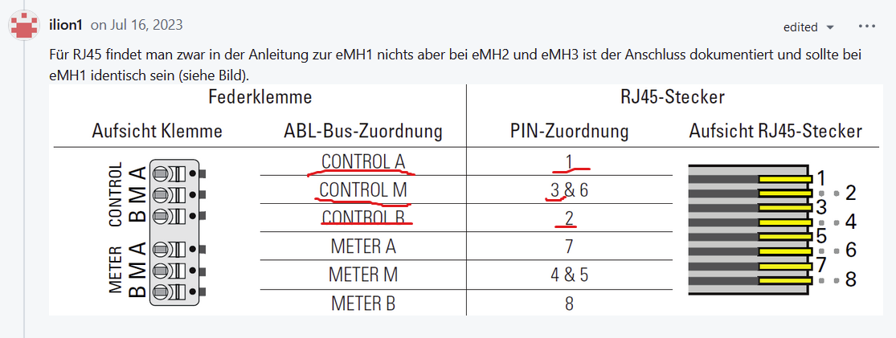

# abl-wallbox
Control of ABL eMH1 Wallbox Charger
It uses minimalmodbus python library that has been patched to accept responses from wallbox (ASCII Modbus) not with ":" in response, but with ">"

# Hardware connection


* Pin 1 - A
* Pin 2 - B
* Pin 3 - common ground, not necessary, but without it connection might not be stable.

Pins 1,2,3 - see https://www.showmecables.com/blog/post/rj45-pinout

Tested and working USB-RS485 Serial:  https://pajenicko.cz/prevodnik-zk-u485-s-ch340-usb-na-rs-485

# Installation
Windows terminal:
```cmd
python3 -m venv venv
venv venv\Scripts\activate
pip install git+https://github.com/cz6ace/abl-wallbox.git
```

Linux terminal:
```bash
python3 -m venv venv
. venv/bin/activate
pip install git+https://github.com/cz6ace/abl-wallbox.git
```
# Usage

## CLI application

If executed only specifying serial port and adress, current status of wallbox is printed to the screen.
It is possible to limit the current (--limit) in Amperes, or pause charging (--pause)

```bash
abl --help
usage: abl [-h] [-p PORT] [-a ADDR] [-l LIMIT] [--pause]

Controll app for ABL eEMH1. It reads status of the wallbox, ability to set limiting current or pause charging

options:
  -h, --help            show this help message and exit
  -p PORT, --port PORT  Serial port COM1 or /dev/ttyUSB0, etc.
  -a ADDR, --addr ADDR  Address of the wallbox from 1 to 16
  -l LIMIT, --limit LIMIT
                        Limit the charging current (via duty)
  --pause               Pauses charging (via 100% duty)
```

## Python library

```python
import minimalmodbus
from abl import Abl, Status

# other stuff

ABL = minimalmodbus.Instrument("COM1", 1, minimalmodbus.MODE_ASCII)
a = Abl(ABL)
a.Wake_Up()
status = a.Read_Status()
print(status)
# set current in Amps
a.Set_Current(6)
# or set the duty from 8..99/100% 100% means pause charging
a.Set_Duty(100)
```
